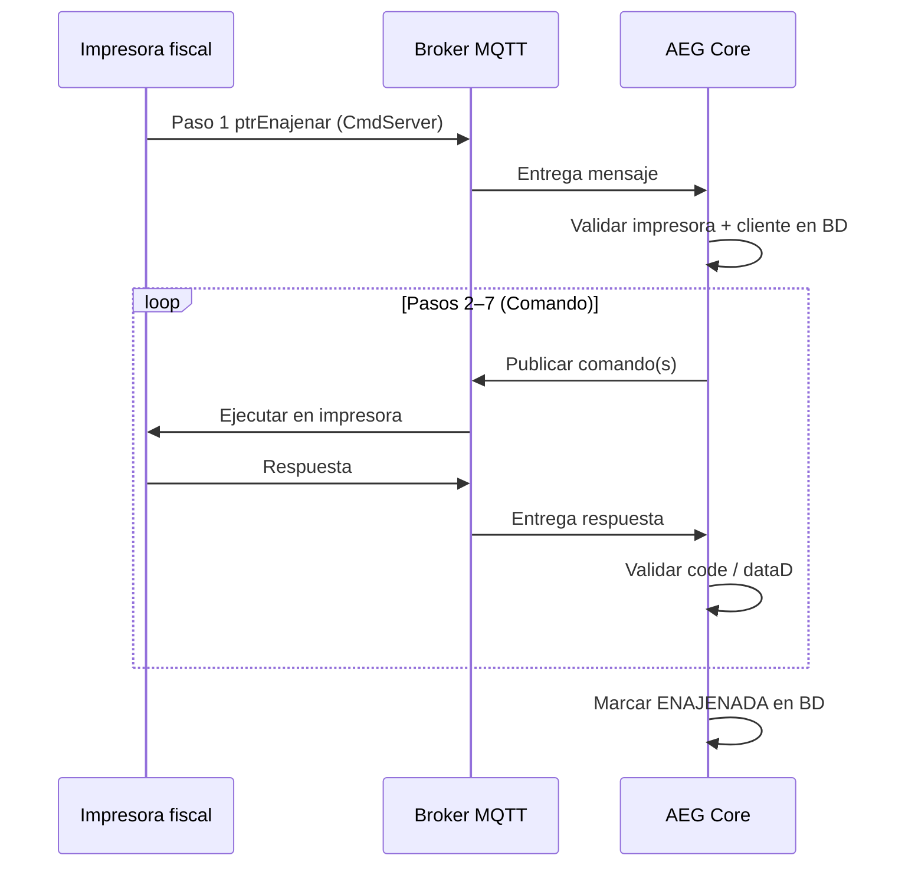

# Enajenación automática de impresoras AEG vía MQTT

Este documento describe el **protocolo completo** para enajenar una impresora fiscal AEG de forma automática mediante comandos MQTT entre la **impresora**, el **broker MQTT** y el **servidor AEG Core**.

Está pensado como referencia para implementación del orquestador backend, pruebas de integración con firmware real y diagnóstico en producción.

---

## Índice

1. [Resumen ejecutivo](#1-resumen-ejecutivo)
2. [Actores y topics MQTT](#2-actores-y-topics-mqtt)
3. [Formato de MAC y correlación](#3-formato-de-mac-y-correlación)
4. [Datos en AEG Core](#4-datos-en-aeg-core)
5. [Flujo general (7 pasos)](#5-flujo-general-7-pasos)
6. [Paso 1 — Solicitud de enajenación (`ptrEnajenar`)](#6-paso-1--solicitud-de-enajenación-ptrenajenar)
7. [Paso 2a — DNF de alerta](#7-paso-2a--dnf-de-alerta)
8. [Paso 3 — Configuración fiscal del cliente](#8-paso-3--configuración-fiscal-del-cliente)
9. [Paso 4 — Estatus del registro](#9-paso-4--estatus-del-registro)
10. [Paso 5 — Factura de prueba](#10-paso-5--factura-de-prueba)
11. [Paso 6 — Nota de crédito](#11-paso-6--nota-de-crédito)
12. [Paso 7 — Reporte Z (cierre)](#12-paso-7--reporte-z-cierre)
13. [Constantes de éxito](#13-constantes-de-éxito)
14. [Máquina de estados del orquestador](#14-máquina-de-estados-del-orquestador)
15. [Timeouts recomendados](#15-timeouts-recomendados)
16. [Persistencia en base de datos](#16-persistencia-en-base-de-datos)
17. [Estado actual en AEG Core](#17-estado-actual-en-aeg-core)
18. [Pendientes y decisiones abiertas](#18-pendientes-y-decisiones-abiertas)
19. [Anexo — Plantillas JSON](#19-anexo--plantillas-json)

---

## 1. Resumen ejecutivo

### Qué es la enajenación

En el dominio AEG, **enajenar** una impresora fiscal significa transferirla formalmente a un **cliente** (contribuyente final). En base de datos el estado pasa a `ENAJENADA` y la impresora queda vinculada al `clientId` correspondiente.

Hoy existe enajenación **manual vía REST** (`PUT /api/printers/{id}` por un distribuidor). Este protocolo define la **enajenación automática** iniciada por la impresora al arrancar, orquestada por el servidor vía MQTT.

### Disparador

Cuando la impresora **enciende**, comprueba que **no está enajenada**, se conecta a Internet y al broker MQTT, y publica un comando `ptrEnajenar` al servidor.

### Resultado esperado

Tras completar los 7 pasos (DNF → configuración fiscal → factura → nota de crédito → Reporte Z), el servidor:

1. Confirma que el proceso fiscal en el dispositivo terminó correctamente.
2. Actualiza la impresora en PostgreSQL a `ENAJENADA`.
3. Cierra la sesión de enajenación MQTT.

### Diagrama de alto nivel



---

## 2. Actores y topics MQTT

### Actores

| Actor | Rol |
|-------|-----|
| **Impresora fiscal** | Inicia el flujo (Paso 1), ejecuta comandos, imprime DNF/factura/NC/Reporte Z, responde con `code` y `dataD`. |
| **Broker MQTT** | Transporte pub/sub (producción: `tcp://206.189.231.128:1883`). |
| **AEG Core** | Único cliente de suscripción “inteligente”; valida BD, orquesta pasos 2–7, persiste estado. |

### Topics

Todos los topics usan la **MAC sin separadores** (12 caracteres hexadecimales en mayúsculas/minúsculas).

| Topic | Dirección | Uso |
|-------|-----------|-----|
| `/{mac}/AEG_Fiscal/Integracion/CmdServer` | Impresora → Servidor | Paso 1: `ptrEnajenar`. Posible canal de respuestas (confirmar con firmware). |
| `/{mac}/AEG_Fiscal/Integracion/Comando` | Servidor → Impresora | Pasos 2–7: todos los comandos de enajenación. |

**Ejemplo** (MAC `20:6E:F1:88:4C:68`):

```
/206EF1884C68/AEG_Fiscal/Integracion/CmdServer   ← impresora publica
/206EF1884C68/AEG_Fiscal/Integracion/Comando     ← servidor publica
```

> **Nota:** el firmware fiscal usa `/` inicial (`/206EF1884C68/...`). El backend también acepta mensajes entrantes sin `/` para compatibilidad, pero publica comandos con `/`.

### Suscripción recomendada en AEG Core

```
+/AEG_Fiscal/Integracion/CmdServer
/+/AEG_Fiscal/Integracion/CmdServer
```

Opcional (si las respuestas no llegan por CmdServer):

```
+/AEG_Fiscal/Integracion/Respuesta
```

Hoy el servidor suscribe por defecto `aeg/telemetry/#` (`MQTT_INBOUND_TOPIC`). Para este protocolo hay que ampliar o reemplazar la suscripción.

---

## 3. Formato de MAC y correlación

### Dos representaciones de la misma MAC

| Contexto | Formato | Ejemplo |
|----------|---------|---------|
| Topic MQTT | Sin `:`, 12 hex | `206EF1884C68` |
| Payload JSON (`macAddr`) | Con `:`, mayúsculas | `20:6E:F1:88:4C:68` |
| Base de datos (`Printer.macAddress`) | Con `:`, validado por regex | `20:6E:F1:88:4C:68` |

**Normalización en servidor:**

```text
206EF1884C68  →  20:6E:F1:88:4C:68
AA:BB:CC:DD:EE:FF  →  AABBCCDDEEFF  (para topic)
```

### Correlación de sesión

Una **sesión de enajenación** se identifica por:

- MAC de la impresora (topic + payload).
- `ptrReg` / `fiscalSerial` (ej. `GRA0000017`).
- Timestamp de inicio.

Solo debe haber **una sesión activa por MAC**. Si la impresora reenvía `ptrEnajenar` mientras hay sesión en curso: ignorar o reanudar según política (recomendado: rechazar duplicado).

---

## 4. Datos en AEG Core

### Entidades involucradas

```text
Printer
  ├── fiscalSerial     → ptrReg / conSerNC
  ├── macAddress       → macAddr / topic
  ├── status           → debe ser ASIGNADA o LABORATORIO al iniciar
  ├── clientId         → cliente destino de la enajenación
  └── distributorId

Client
  └── branch → Company + Branch (datos fiscales)
      ├── Company.rif              → rifEmp, rifCiNC
      ├── Company.businessName     → nomEmp, razSocNC
      ├── Company.contributorType  → línea 4 encFacFijo
      └── Branch.address, city, state → encFacFijo
```

### Validaciones previas (Paso 1)

Antes de iniciar el Paso 2, el servidor debe comprobar:

| Regla | Error si falla |
|-------|----------------|
| Existe impresora con `fiscalSerial = ptrReg` | No encontrada |
| `macAddress` coincide con payload y topic | MAC mismatch |
| `status = ASIGNADA` o `LABORATORIO` | No apta para enajenación |
| `clientId != null` | Sin cliente asignado |
| Cliente → Company tiene `rif` y `businessName` | Datos fiscales incompletos |
| Branch tiene `address`, `city`, `state` | Encabezado incompleto (Paso 3b) |
| No hay otra sesión activa para esa MAC | Sesión duplicada |
| Impresora no está ya `ENAJENADA` | Idempotencia / ignorar |

### Formato RIF

- En BD: patrón `^[VEJPG][0-9]{7,9}$` (sin guión).
- En MQTT fiscal: con guión, ej. `J-500662998`.
- El servidor debe formatear al armar payloads (insertar guión tras el primer carácter si aplica).

### Tipo de contribuyente → texto fiscal

| `ContributorType` (BD) | Línea `encFacFijo[3]` |
|------------------------|----------------------|
| `ORDINARIO` | `CONTRIBUYENTE ORDINARIO` |
| `ESPECIAL` | `CONTRIBUYENTE ESPECIAL` |
| `FORMAL` | `CONTRIBUYENTE FORMAL` |

---

## 5. Flujo general (7 pasos)

| Paso | Nombre | Payload | Tipo mensaje |
|------|--------|---------|--------------|
| 1 | Solicitud enajenación | `ptrEnajenar` | Objeto (impresora → server) |
| 2a | DNF alerta | 11 comandos DNF | Array |
| 3a | RIF + razón social | `fiscalAEG` | Objeto |
| 3b | Encabezado / dirección | `wFileSPIFF` | Objeto |
| 3c | Impuestos y formas de pago | `wFileSPIFF` | Objeto |
| 4 | Estatus registro | `StaInf` | Objeto |
| 5 | Factura de prueba | 8 comandos | Array |
| 6 | Nota de crédito | 13 comandos | Array |
| 7 | Reporte Z | `genImpRepZ` | Objeto |

Todos los pasos 2–7 publican en **`/{mac}/AEG_Fiscal/Integracion/Comando`**, salvo el Paso 1 que la impresora envía a **`CmdServer`**.

---

## 6. Paso 1 — Solicitud de enajenación (`ptrEnajenar`)

### Cuándo

La impresora enciende, detecta que **no está enajenada**, tiene conectividad y publica al broker.

### Topic (impresora → servidor)

```text
{macSinSeparadores}/AEG_Fiscal/Integracion/CmdServer
```

### Payload

```json
{
  "cmd": "ptrEnajenar",
  "data": {
    "ptrReg": "GRA0000017",
    "macAddr": "20:6E:F1:88:4C:68"
  }
}
```

| Campo | Descripción |
|-------|-------------|
| `ptrReg` | Registro fiscal de la impresora (`Printer.fiscalSerial`). Formato típico: 3 letras + 7 dígitos. |
| `macAddr` | MAC de la impresora con separadores `:` |

### Acción del servidor

1. Parsear topic → extraer MAC compacta.
2. Parsear JSON → validar `cmd === "ptrEnajenar"`.
3. Buscar impresora por `fiscalSerial` y verificar MAC.
4. Validar precondiciones (sección 4).
5. Crear `EnajenacionSession` en estado `VALIDATED`.
6. Iniciar Paso 2a.

No hay respuesta documentada al Paso 1 en la spec actual; confirmar si la impresora espera ACK antes del DNF.

---

## 7. Paso 2a — DNF de alerta

### Objetivo

Imprimir un **Documento No Fiscal (DNF)** en la impresora advirtiendo que entrará en proceso de enajenación y no debe usarse hasta que se imprima el Reporte Z.

### Topic (servidor → impresora)

```text
/{mac}/AEG_Fiscal/Integracion/Comando
```

### Comando (array de 11 elementos)

Publicar el array **completo** en un solo mensaje MQTT:

```json
[
  { "cmd": "aperDNF", "data": "DOCUMENTO NO FISCAL" },
  { "cmd": "efeNeDAnJuCeDNF", "data": "***** ALERTA *****" },
  { "cmd": "efeNoDAnJuCeDNF", "data": "IMPRESORA EN PROCESO" },
  { "cmd": "efeNoDAnJuCeDNF", "data": "DE ENAJENACION" },
  { "cmd": "efeNoDAnJuCeDNF", "data": "DURANTE EL PROCESO" },
  { "cmd": "efeNoDAnJuCeDNF", "data": "DE ENAJENACION" },
  { "cmd": "efeNoDAnJuCeDNF", "data": "NO PUEDE SER UTILIZADA," },
  { "cmd": "efeNoDAnJuCeDNF", "data": "DEBE MANTENERSE ENCENDIDA." },
  { "cmd": "efeNoDAnJuCeDNF", "data": "EL PROCESO TERMINA CUANDO SE" },
  { "cmd": "efeNoDAnJuCeDNF", "data": "IMPRIMA UN REPORTE Z" },
  { "cmd": "endDNF", "data": "TIEMPO APROXIMADO DE ESPERA 3 MIN" }
]
```

> **Atención:** el segundo comando usa `efeNeDAnJuCeDNF` (**Ne**); los demás usan `efeNoDAnJuCeDNF` (**No**). Respetar el nombre exacto al validar la respuesta.

### Respuesta esperada (array de 11 elementos)

Cada elemento:

```json
{ "cmd": "...", "code": 0, "dataD": 0 }
```

Excepto el último:

```json
{ "cmd": "endDNF", "code": 0, "dataD": 7 }
```

### Criterio de éxito

- 11 respuestas en el mismo orden de `cmd`.
- Todos `code === 0`.
- Todos `dataD === 0` excepto `endDNF` con `dataD === 7`.

### Timeout

~3 minutos (coherente con el texto del DNF).

---

## 8. Paso 3 — Configuración fiscal del cliente

Tres comandos **secuenciales** (publicar → esperar respuesta → siguiente). Cada uno es un **objeto JSON** (no array).

### 8.1 Paso 3a — RIF y nombre de empresa (`fiscalAEG`)

Graba `rifEmp.json` en la impresora.

```json
{
  "cmd": "fiscalAEG",
  "data": {
    "nameFile": "rifEmp.json",
    "Access": "config",
    "contenido": {
      "tituloSeniat": "SENIAT",
      "rifEmp": "J-500662998",
      "nomEmp": "INVERSIONES SHOP COMPUTER 2020, C.A."
    }
  }
}
```

| Campo dinámico | Origen |
|----------------|--------|
| `rifEmp` | `Company.rif` (formateado con guión) |
| `nomEmp` | `Company.businessName` |

**Respuesta:**

```json
{ "cmd": "fiscalAEG", "code": 0, "dataD": 0 }
```

**Timeout:** > 1 minuto (puede tardar más).

---

### 8.2 Paso 3b — Encabezado fijo / dirección (`wFileSPIFF`)

Graba `paramFacSPIFF.json`.

```json
{
  "cmd": "wFileSPIFF",
  "data": {
    "Access": "AeG-1968-2024",
    "nameFile": "paramFacSPIFF.json",
    "contenido": {
      "encFacFijo": [
        "AV. URDANETA EDIF. CASA BERA",
        "PISO PB LOCAL -005-C URB. LA CANDELARIA",
        "CARACAS, DISTRITO CAPITAL ZONA POSTAL 1071",
        "CONTRIBUYENTE ORDINARIO"
      ],
      "pieFacFijo": [
        "PIE DE TICKET 01",
        "PIE DE TICKET 02",
        "PIE DE TICKET 03"
      ]
    }
  }
}
```

| Línea | Origen sugerido |
|-------|-----------------|
| `encFacFijo[0]` | Primera parte de `Branch.address` |
| `encFacFijo[1]` | Segunda parte de `Branch.address` (partir si excede longitud máxima del firmware) |
| `encFacFijo[2]` | `{city}, {state}` + código postal si existe |
| `encFacFijo[3]` | Texto derivado de `Company.contributorType` |
| `pieFacFijo[]` | Configuración opcional `app.mqtt.enajenacion.ticket-footer-lines` separada por `|` |

> **Gap BD:** no hay campo de código postal en `Branch`. Definir regla (campo nuevo, constante vacía, o omitir “ZONA POSTAL”).

**Respuesta:**

```json
{ "cmd": "wFileSPIFF", "code": 0, "dataD": 0 }
```

---

### 8.3 Paso 3c — Impuestos y formas de pago (`wFileSPIFF`)

Graba `configSPIFFS.json`. Contenido **fijo** para todas las enajenaciones (plantilla embebida en el servidor).

Incluye:

- Moneda simbólica: `Bs`
- Tipos de impuesto: Exonerado, IVA G (16%), R (8%), A (31%), Percibido
- 16 formas de pago (EFECTIVO, tarjetas, transferencia, divisas con IGTF 3%)

Ver [Anexo — configSPIFFS.json](#193-paso-3c--configspiffsjson).

**Respuesta:**

```json
{ "cmd": "wFileSPIFF", "code": 0, "dataD": 0 }
```

---

## 9. Paso 4 — Estatus del registro

### Objetivo

Consultar en la impresora el número de registro fiscal (`ptrReg`) tras cargar la configuración, antes de emitir documentos de prueba.

### Comando (servidor → impresora)

Topic: `/{mac}/AEG_Fiscal/Integracion/Comando`

```json
{
  "cmd": "StaInf",
  "data": {
    "status": "NroRegMa"
  }
}
```

| Campo | Descripción |
|-------|-------------|
| `cmd` | `StaInf` — solicitud de información de estatus |
| `data.status` | `NroRegMa` — número de registro de la máquina |

### Respuesta (impresora → servidor)

Topic: `/{mac}/AEG_Fiscal/Integracion/CmdServer`

```json
{
  "cmd": " StaInf ",
  "code": 0,
  "dataS": "GRA0000017"
}
```

| Campo | Descripción |
|-------|-------------|
| `code` | `0` = éxito |
| `dataS` | Registro fiscal leído en la impresora; debe coincidir con `ptrReg` de la sesión |

### Validación en AEG Core

- `cmd` debe ser `StaInf` (se toleran espacios alrededor del nombre).
- `code === 0`.
- `dataS` no vacío y coincide con `Printer.fiscalSerial` / `ptrReg` del paso 1.

### Configuración

- `app.mqtt.enajenacion.skip-registration-status=false` (por defecto).
- Timeout: `app.mqtt.enajenacion.timeout.reg-status-seconds=60`.

---

## 10. Paso 5 — Factura de prueba

### Objetivo

Emitir una factura fiscal de prueba con líneas en los 5 tipos impositivos configurados en el Paso 3c. Forma parte del ritual fiscal de enajenación (no es una venta real del cliente).

### Comando (array de 8 elementos)

```json
[
  { "cmd": "proF", "data": { "pre": 100, "cant": 1000, "imp": 1, "des01": "PRODUCTO" } },
  { "cmd": "proF", "data": { "pre": 100, "cant": 1000, "imp": 2, "des01": "PRODUCTO" } },
  { "cmd": "proF", "data": { "pre": 100, "cant": 1000, "imp": 3, "des01": "PRODUCTO" } },
  { "cmd": "proF", "data": { "pre": 100, "cant": 1000, "imp": 4, "des01": "PRODUCTO" } },
  { "cmd": "proF", "data": { "pre": 100, "cant": 1000, "imp": 5, "des01": "PRODUCTO" } },
  { "cmd": "subToF", "data": 1, "valor": 0 },
  { "cmd": "fpaF", "data": { "tipo": 1, "monto": -1, "tasaConv": 0 } },
  { "cmd": "endFac", "data": 1 }
]
```

### Campos `proF`

| Campo | Valor spec | Interpretación |
|-------|------------|----------------|
| `pre` | 100 | Precio unitario (probablemente céntimos → Bs 1,00) |
| `cant` | 1000 | Cantidad (escala ×1000) |
| `imp` | 1–5 | Índice de impuesto (alinea con `impArt` del Paso 3c) |
| `des01` | `"PRODUCTO"` | Descripción fija |

### `fpaF`

| Campo | Valor | Significado |
|-------|-------|-------------|
| `tipo` | 1 | Primera forma de pago → EFECTIVO |
| `monto` | -1 | Monto total de la factura |
| `tasaConv` | 0 | Sin conversión |

### Respuesta esperada (array de 8)

| cmd | code | dataD |
|-----|------|-------|
| `proF` ×5 | 0 | 0 |
| `subToF` | 0 | **555** |
| `fpaF` | 0 | 0 |
| `endFac` | 0 | **8** |

### Datos a persistir en sesión

Tras éxito, guardar para el Paso 6:

- `numeroFactura` → usar `1` si el firmware no devuelve otro valor en la respuesta
- `fechaFactura` → fecha actual en formato `dd/MM/yyyy`

---

## 11. Paso 6 — Nota de crédito

### Objetivo

Anular la factura de prueba del Paso 5 mediante una Nota de Crédito (NC), mismo monto y mismos tipos impositivos.

### Comando (array de 13 elementos)

**Cabecera (dinámica):**

```json
{ "cmd": "nroFacNC", "data": 1 },
{ "cmd": "fechFacNC", "data": "05/04/2026" },
{ "cmd": "conSerNC", "data": "GRA0000017" },
{ "cmd": "rifCiNC", "data": "J-500662998" },
{ "cmd": "razSocNC", "data": ["INVERSIONES SHOP COMPUTER 2020, C.A."] }
```

| Campo | Origen |
|-------|--------|
| `nroFacNC` | Número factura del Paso 5 (sesión) |
| `fechFacNC` | Fecha factura Paso 5 (`dd/MM/yyyy`) |
| `conSerNC` | `Printer.fiscalSerial` |
| `rifCiNC` | `Company.rif` formateado |
| `razSocNC` | Array con `Company.businessName` (partir en varias líneas si es muy largo) |

**Productos y cierre (plantilla fija):**

```json
{ "cmd": "prodNC", "data": { "pre": 100, "cant": 1000, "imp": 1, "des01": "PRODUCTO" } },
{ "cmd": "prodNC", "data": { "pre": 100, "cant": 1000, "imp": 2, "des01": "PRODUCTO" } },
{ "cmd": "prodNC", "data": { "pre": 100, "cant": 1000, "imp": 3, "des01": "PRODUCTO" } },
{ "cmd": "prodNC", "data": { "pre": 100, "cant": 1000, "imp": 4, "des01": "PRODUCTO" } },
{ "cmd": "prodNC", "data": { "pre": 100, "cant": 1000, "imp": 5, "des01": "PRODUCTO" } },
{ "cmd": "endPoNC", "data": 1, "valor": 0 },
{ "cmd": "fpaNC", "data": { "tipo": 1, "monto": -1, "tasaConv": 0 } },
{ "cmd": "endNC", "data": 1 }
```

### Respuesta esperada (array de 13)

| cmd | code | dataD |
|-----|------|-------|
| `nroFacNC`, `fechFacNC`, `conSerNC`, `rifCiNC`, `razSocNC` | 0 | 0 |
| `prodNC` ×5 | 0 | **9** |
| `endPoNC` | 0 | **555** |
| `fpaNC` | 0 | 0 |
| `endNC` | 0 | **10** |

---

## 12. Paso 7 — Reporte Z (cierre)

### Objetivo

Imprimir el **Reporte Z** fiscal. Cierra el proceso en la impresora (como anunciaba el DNF del Paso 2a).

### Comando (objeto único)

```json
{
  "cmd": "genImpRepZ",
  "data": 1
}
```

### Respuesta

```json
{
  "cmd": "genImpRepZ",
  "code": 0,
  "dataD": 0
}
```

### Acción final del servidor

1. Validar respuesta OK.
2. Actualizar `Printer.status = ENAJENADA` (y conservar `clientId`, actualizar `installationDate` si aplica).
3. Marcar sesión `COMPLETED`.
4. Registrar auditoría (opcional: log estructurado con duración total, MAC, ptrReg, clientId).

**Este paso completa el protocolo de enajenación automática.**

---

## 13. Constantes de éxito

| Constante | Valor | Paso / cmd |
|-----------|-------|------------|
| `DNF_END_OK` | 7 | `endDNF` |
| `INVOICE_END_OK` | 8 | `endFac` |
| `CREDIT_NOTE_END_OK` | 10 | `endNC` |
| `REPORT_Z_OK` | 0 | `genImpRepZ` dataD |
| `SUBTOTAL_DATA_D` | 555 | `subToF`, `endPoNC` |
| `PROD_NC_LINE_DATA_D` | 9 | cada `prodNC` |

Cualquier `code !== 0` en cualquier paso → abortar flujo, estado sesión `FAILED`, **no** marcar `ENAJENADA` en BD.

---

## 14. Máquina de estados del orquestador

```text
IDLE
  → VALIDATED          (Paso 1 OK)
  → DNF_SENT           (publicó Paso 2a)
  → DNF_OK             (endDNF dataD=7)
  → FISCAL_RIF_SENT    (3a)
  → FISCAL_RIF_OK
  → HEADER_SENT        (3b)
  → HEADER_OK
  → CONFIG_SENT        (3c)
  → CONFIG_OK
  → REG_STATUS_SENT    (4, StaInf)
  → REG_STATUS_OK
  → INVOICE_SENT       (5)
  → INVOICE_OK         (endFac dataD=8)
  → CREDIT_NOTE_SENT   (6)
  → CREDIT_NOTE_OK     (endNC dataD=10)
  → REPORT_Z_SENT      (7)
  → COMPLETED          (genImpRepZ OK + BD actualizada)

En cualquier punto: FAILED (error / timeout)
```

### Reglas de transición

- Cada paso es **bloqueante**: no avanzar sin respuesta válida.
- Reintentos: definir política (ej. 0 reintentos en prod, 1 retry en DNF/Reporte Z).
- Idempotencia: si impresora ya `ENAJENADA`, ignorar nuevo `ptrEnajenar` o responder sin re-ejecutar.

---

## 15. Timeouts recomendados

| Paso | Timeout sugerido | Motivo |
|------|------------------|--------|
| 2a DNF | 180 s | Texto DNF indica ~3 min |
| 3a fiscalAEG | 120 s | Grabación SPIFFS lenta |
| 3b, 3c | 60 s | Archivos de config |
| 4 | 60 s | Consulta |
| 5 Factura | 180 s | Impresión física |
| 6 NC | 180 s | Impresión física |
| 7 Reporte Z | 120 s | Cierre fiscal |

Timeout global de sesión: ~15–20 minutos.

---

## 16. Persistencia en base de datos

### Antes del flujo (precondición)

```text
Printer.status = ASIGNADA o LABORATORIO
Printer.clientId = <cliente destino>
Printer.fiscalSerial = ptrReg
Printer.macAddress = macAddr
```

### Al completar Paso 7

Equivalente a `PrinterServiceImpl.applyDistributorDisposition`:

```text
Printer.status = ENAJENADA
Printer.clientId = (sin cambio)
Printer.installationDate = now() (si no estaba fijada)
```

### Tabla sugerida para sesiones (implementación futura)

```sql
-- enajenacion_sessions (propuesta)
id, printer_id, mac, fiscal_serial, client_id,
state, current_step, started_at, completed_at,
last_error, invoice_number, invoice_date, ...
```

Permite reintentos, auditoría y diagnóstico sin depender solo de logs MQTT.

---

## 17. Estado actual en AEG Core

| Capacidad | Estado |
|-----------|--------|
| Publicar MQTT a topic arbitrario | ✅ `MqttService.publish` |
| Suscribirse a topics fiscales | ❌ Default `aeg/telemetry/#` |
| Handler `ptrEnajenar` | ❌ No implementado |
| Orquestador pasos 2–7 | ❌ No implementado |
| Enajenación REST (distribuidor) | ✅ `PUT /api/printers/{id}` |
| Monitor MQTT (admin) | ✅ WebSocket + historial |

---

## 18. Pendientes y decisiones abiertas

1. **Topic de respuestas:** ¿impresora responde en `CmdServer`, `Respuesta` u otro?
2. **ACK Paso 1:** ¿el servidor debe responder algo a `ptrEnajenar` antes del DNF?
3. **Código postal:** campo en BD o regla de formateo para `encFacFijo[2]`.
4. **Número de factura:** ¿`nroFacNC` siempre `1` o viene en respuesta del Paso 5?
5. **`subToF.dataD = 555`:** ¿valor fijo con la plantilla actual o calculado?
6. **Re-enajenación:** comportamiento si la impresora reinicia a mitad de flujo.
7. **Seguridad MQTT:** autenticación broker, ACL por MAC, TLS.

---

## 19. Anexo — Plantillas JSON

### 19.1 Paso 2a — DNF completo

Ver [sección 7](#7-paso-2a--dnf-de-alerta).

### 19.2 Paso 3c — configSPIFFS.json (contenido fijo)

```json
{
  "cmd": "wFileSPIFF",
  "data": {
    "nameFile": "configSPIFFS.json",
    "contenido": {
      "simMonL": "Bs",
      "impArt": {
        "desc": ["Exonerado", "IVA", "Reducido", "Lujo", "Percibido"],
        "abrev": ["(E)", "(G)", "(R)", "(A)", "(P)"],
        "valor": [0, 1600, 800, 3100, 0],
        "impMontoPtr": [
          "EXENTO (E)",
          "BI G (16.00%)",
          "BI R (8.00%)",
          "BI A (31.00%)",
          "PERCIBIDO"
        ],
        "impMontoImp": ["", "IVA G (16.00%)", "IVA R (8.00%)", "IVA A (31.00%)", ""]
      },
      "formPago": {
        "tituloFormPag": "FORMA DE PAGO",
        "desc": [
          "EFECTIVO", "T. DEBITO", "T. CREDITO", "TRANSFERENCIA", "PAGO MOVIL", "BIOPAGO",
          "EFECTIVO 7", "EFECTIVO 8", "EFECTIVO 9", "EFECTIVO 10",
          "DIVISA 1", "DIVISA 2", "DIVISA 3", "DIVISA 4", "DIVISA 5", "DIVISA 6"
        ],
        "impG": [0, 0, 0, 0, 0, 0, 0, 0, 0, 0, 300, 300, 300, 300, 300, 300],
        "impMontoPtr": [
          "", "", "", "", "", "", "", "", "", "",
          "BI IGTF (3.00%)", "BI IGTF (3.00%)", "BI IGTF (3.00%)",
          "BI IGTF (3.00%)", "BI IGTF (3.00%)", "BI IGTF (3.00%)"
        ],
        "impMontoImp": [
          "", "", "", "", "", "", "", "", "", "",
          "IGTF (3.00%)", "IGTF (3.00%)", "IGTF (3.00%)",
          "IGTF (3.00%)", "IGTF (3.00%)", "IGTF (3.00%)"
        ]
      }
    }
  }
}
```

### 19.3 Referencias en el repositorio

| Recurso | Ubicación |
|---------|-----------|
| Monitor MQTT | [MQTT_MONITOR.md](./MQTT_MONITOR.md) |
| Enajenación REST | `PrinterServiceImpl.applyDistributorDisposition` |
| Estados impresora | `PrinterStatus.ENAJENADA`, `ASIGNADA`, `LABORATORIO` |
| Config MQTT prod | `.do/app.yaml`, `application.properties` |

---

*Documento generado a partir de la especificación funcional del protocolo de enajenación AEG (pasos 1–7). Actualizar cuando se confirme el Paso 4 y el topic de respuestas con el equipo de firmware.*
